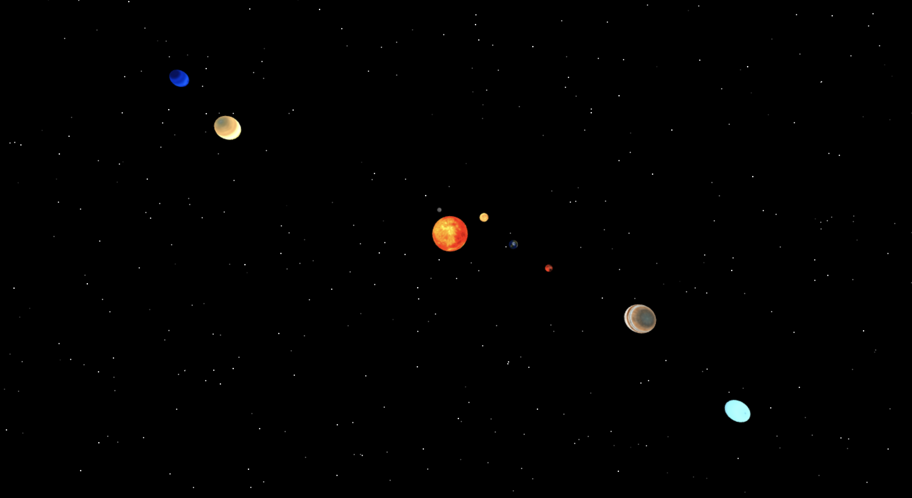
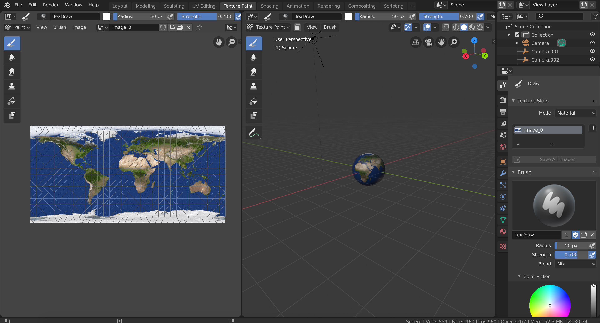

# Space

## Descriptions:

An application which allow the user to view the solar system and a 3D view. 

## Preview:





## Getting Started:

These instructions will get a copy of the project up and running on your local machine for usage and testing purposes.

clone down the repository:
```
$ git https://github.com/Inzurriaga/Space
```

cd into directory and run npm install:
```
$ npm install
```

launch in your browser:
```
$ npm run
```

## Project Tools:
HTMl\
Javascript\
CSS\
React\
Three.js\
Particle.js\
Blender - to create the 3d models

## Contributors
Gabriel Inzurriaga: https://github.com/Inzurriaga
